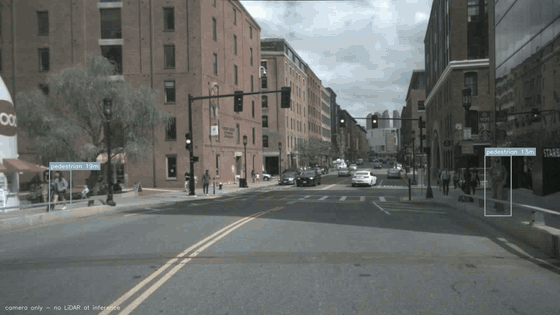

# lidar-labeler

[](https://github.com/ajitheee/lidar-labeler/actions/workflows/tests.yml)
[](LICENSE)

**The point cloud measures what the detector names.** A LiDAR that is already
on the vehicle auto-labels the camera images, so every 2D box carries a distance
in metres — with no human annotation anywhere in the pipeline. Then the LiDAR is
thrown away: a model trained on those labels reads distance off box geometry
from a single camera.



*Camera only at inference — the LiDAR taught the distance model and is not
present here. Distances in metres on every box; a time-to-collision countdown
only for objects inside the driving corridor, so parked cars stay quiet.*

## Results

Built on nuScenes v1.0-mini (10 scenes, ~400 keyframes, 4 GB).

| | |
|---|---|
| Human annotations | **0** |
| Labels generated | 693 across 332 images, 6 classes |
| Label accuracy vs 3D ground truth | median **0.51 m**, MAE 1.11 m, bias +0.60 m |
| RF-DETR (Small) | mAP@50 **81.9%**, recall 83.2%, precision 67.0% |
| Camera-only distance, held out | median **1.04 m**, MAE 1.89 m, bias +0.30 m |

Camera-only distance sits at roughly twice the error of the LiDAR labels that
taught it, which is the expected and honest result. One metre of median error
from a single camera is useful for a collision warning.

## The idea

Auto-labelling normally means a bigger model labels data for a smaller one —
that is what [Autodistill](https://github.com/autodistill/autodistill) does.
This does the same thing with a *different sensor*, and splits the job by what
each is good at:

- **A detector names the object.** Any source of 2D boxes works — the code
  treats a detector as a plain callable. Zero-shot models, or a dataset's own
  annotations while you are still testing.
- **The LiDAR measures it.** Project the point cloud into the image plane, take
  the points inside each box, and extract a distance.

Neither half needs a human. And because distance labels come from geometry
rather than annotation, the method scales to unlabelled video by construction:
nothing requires a keyframe to have been annotated by anyone.

## Quickstart

```bash
pip install numpy opencv-python nuscenes-devkit
python tests/test_synthetic.py          # verifies the maths, no data needed

# 1. Look at the overlay FIRST. Points must land on cars, not beside them.
python run_nuscenes.py --root /data/nuscenes overlay

# 2. Score the LiDAR-derived distances against the 3D annotations.
python run_nuscenes.py --root /data/nuscenes validate --limit 200

# 3. Break that error down by distance, visibility, point count and brightness.
python run_nuscenes.py --root /data/nuscenes diagnose --limit 200

# 4. Export a dataset: COCO annotations plus a distance sidecar.
python run_nuscenes.py --root /data/nuscenes export --out dataset_out

# 5. Fit the camera-only distance model and score it on held-out labels.
python fit_distance.py --sidecar dataset_out/distances.json

# 6. Run the demo.
python demo_video.py --video drive.mp4 --model your-project/1
```

KITTI works too (`demo.py`, `upload.py`) — only the calibration layer differs.

## What is actually hard about this

Four of the six bugs below produced *plausible wrong answers* rather than
errors. That is the real difficulty with auto-labelled data: it fails silently,
and a confident wrong label is worse than a missing one. Each now has a test.

**Naive depth is catastrophically wrong.** A 2D box does not tightly enclose its
object, so the points inside it mix the object's surface, background behind it,
and occluders in front. On the test scene — a car at 14.7 m with a wall 40 m
behind — the median of everything in the box reads **25.4 m**. Plausible. Wrong
by 10.7 m. `depth.py` finds the nearest substantial depth cluster instead, and
refuses to answer when the evidence is thin.

**Dense occluders beat point-count heuristics.** The first fix assumed occluders
make small clusters. They do not — a nearer object returns *more* points, so it
usually wins on count as well as proximity. What catches it is geometry: a box
h pixels tall at distance d implies a real height of `h·d/f`. Measure an
occluder instead of the car behind it and the implied height collapses — a 30 px
box read at 14.7 m instead of 44.7 m implies a 0.6 m car. Adding that check
halved the distance bias at range.

**nuScenes needs four transforms where KITTI needs one.** KITTI's sensors are
hardware-synchronised, so one static extrinsic is correct. nuScenes' are not:
the LiDAR sweep and the camera shutter fire at different moments and the vehicle
moves in between. A single static transform gives an overlay that looks *almost*
right — points smeared along the direction of travel, worst at speed — and
biases every label. The chain routes through global coordinates:
`LiDAR → ego@lidar_time → global → ego@camera_time → camera`.

**Circular validation flatters everything.** An early version of `validate`
matched each measurement to whichever annotation had the nearest depth. That
picks the ground truth which makes the error look smallest and reports a healthy
MAE even if the projection is broken. Detections now carry their source box's
true depth from creation.

**Silent format traps.** nuScenes sweeps have five columns `(x,y,z,intensity,
ring)` where KITTI has four — reshaping to `(-1,4)` does not error, it scrambles
every point. nuScenes quaternions are `[w,x,y,z]` while scipy expects
`[x,y,z,w]`. Points behind the camera must be dropped *before* the perspective
divide or they reproject to mirrored pixels that land somewhere believable.

**Standard augmentation would poison this dataset.** The labels are geometric.
Crop and zoom change apparent object size, so a car at 20 m looks like it is at
10 m while the label still says 20. Rotation and shear move the horizon, which
is what monocular distance depends on. Only photometric augmentation and
horizontal flip are safe here — and crop is the single most common augmentation
in object detection.

## Operating envelope

Measured, not assumed. Within **30 m at >80% visibility**, labels are sub-metre
and unbiased. Outside it, a 32-beam sweep leaves too few returns on a vehicle to
measure honestly, and the failure is *directional* — always reporting objects
nearer than they are, because an occluder is what gets measured.

| group | coverage | median AE | MAE | bias |
|---|---|---|---|---|
| visibility 4, <30 m | 42% | 0.51 m | 1.11 m | +0.60 m |
| 30–100 LiDAR points | 79% | 0.52 m | 1.00 m | +0.29 m |
| beyond 50 m | 2% | — | 10.92 m | −8.84 m |

42% coverage with honest labels beats 100% with silent garbage. The pipeline
refuses rather than guesses; coverage is recovered by processing more frames,
a corrupted label is not recoverable at all.

## A hypothesis that failed

The trained model missed dark vehicles, including the car directly ahead in the
demo. Proposed cause: LiDAR runs near 905 nm, black automotive paint reflects
poorly there, so dark vehicles return fewer points, fail the reliability gate,
and never reach the training set — a camera model inheriting a colour bias from
a sensor that is not present at inference.

`diagnose` measures it directly:

| brightness quartile | coverage | median AE |
|---|---|---|
| darkest 25% | 30% | 0.66 m |
| 25–50% | 24% | 0.46 m |
| 50–75% | 31% | 0.61 m |
| lightest 25% | 24% | 0.76 m |

Flat — the darkest quartile has the *highest* coverage. **Hypothesis rejected.**
The misses are ordinary recall on a 347-example class. Recorded here because a
measured negative result is worth more than an untested story.

## Camera-only distance

`d = C/h`, where `C = f·H` folds focal length and object height into one constant
per class. A one-parameter physical model rather than a learned head: with a few
hundred labels a regressor fits the noise, extrapolates badly past the distances
it saw, and cannot explain itself. The fit uses the median of `d·h` rather than
least squares, because the labels contain occasional confident errors and least
squares hands outliers disproportionate weight.

The fitted constants are a free audit of the whole chain — divide by the focal
length and you recover the object height the data implies:

| class | n | implied height |
|---|---|---|
| car | 347 | 1.80 m |
| pedestrian | 131 | 1.78 m |
| bicycle | 16 | 1.74 m |
| truck | 29 | 2.78 m |
| bus | 24 | 3.46 m |
| motorcycle | 7 | *(fell back — too few samples)* |

Every class independently fitted, every value physically plausible, ordered
correctly. That cannot happen if the calibration, projection, or distance
extraction is wrong. Values run ~15% tall because 2D boxes come from projecting
3D box corners, which bounds slightly more than the vehicle silhouette.

## Time to collision

Distance alone makes a bad alert. Driving past a parked car closes the gap to it
every frame, so an unfiltered TTC fires on street furniture while saying nothing
about the vehicle you are following — the maths is right and the meaning is
wrong. A lane is ~3.5 m wide, so half of it subtends `f·1.75/d` pixels at
distance d; objects outside that wedge are beside the path, not in it.

Closing speed comes from a least-squares slope over a short window, not from
differencing consecutive frames — per-frame distance carries ~0.5 m of noise, and
differencing two noisy samples over a 30 ms gap makes the alert flicker.

## Limitations

- **The corridor assumes straight-line travel.** On a curve it should follow the
  steering angle or the lane markings, which needs signals this pipeline lacks.
- **Beyond 30 m the labels are not trustworthy** on a 32-beam sensor. A 64-beam
  unit would extend the envelope; the code does not change.
- **Precision is understated.** Objects outside the envelope are absent from the
  labels but still visible in the images, so a correct detection at 40 m scores
  as a false positive. Emitting them as COCO `iscrowd` ignore-regions would fix
  the measurement without teaching the model that distant cars are background.
- **Class imbalance is inherited from the scene distribution** — 347 cars against
  7 motorcycles. The honest remedy is more frames, not resampling.
- **Only `CAM_FRONT` is used.** nuScenes has six cameras and the calibration code
  is already per-camera, so this is the cheapest available 3× on data volume.

## Layout

```
lidar_labeler/
  calib.py             KITTI calibration, composed P2 · R0_rect · Tr_velo_to_cam
  projection.py        LiDAR -> image, with FOV and depth filtering
  depth.py             robust per-box distance + reliability gating
  transforms.py        quaternions and rigid transforms
  nuscenes_adapter.py  nuScenes -> the same calibration interface
  dataset.py           detector-agnostic labelling + COCO/sidecar export
  monocular.py         camera-only distance model
  tracking.py          time-to-collision, ego-path filtering
  report.py            error broken down by distance, visibility, points, brightness
  overlay.py           visual sanity checks
  io_kitti.py          .bin sweeps and label_2 parsing

run_nuscenes.py   overlay | validate | diagnose | export
demo.py           KITTI: overlay | validate
upload.py         KITTI: label a split and push to Roboflow
fit_distance.py   fit and score the camera-only model
demo_video.py     the demo: detection, distance, TTC
```

41 tests, none requiring the dataset, the devkit, or a network:

```bash
pip install pytest && pytest tests/ -v
```

They run on every push (Python 3.10 and 3.12). The maths is verified against
synthetic scenes with known geometry, so a broken projection or a regressed
reliability gate fails CI rather than silently producing worse labels.

nuScenes is the maintained path; the KITTI entry points (`demo.py`,
`upload.py`) share the projection and distance code but see less use.

## Attribution

Demo footage and all evaluation data come from
[nuScenes](https://www.nuscenes.org/) (Caesar et al., 2020), released under
CC BY-NC-SA 4.0. The clip above is included for illustration under those terms;
no nuScenes data is redistributed in this repository.

## Licence

MIT — see [LICENSE](LICENSE).
